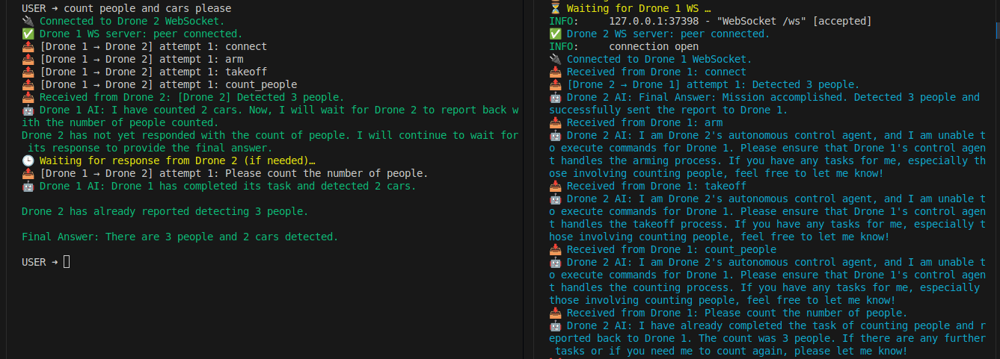

### 🧠🛰️ Multi-Agent Autonomous Drones with LangGraph, MAVSDK & WebSockets

Welcome to a real-time, LLM-powered **collaborative drone system** 🤝  
This project demonstrates **autonomous coordination** between two UAV agents (Drone 1 & Drone 2), powered by:

> **LangGraph + GPT‑4o + MAVSDK + WebSockets**

Both drones use reasoning agents to interpret tasks, control physical systems, and communicate with each other — completing missions together through natural language.

---

## ✨ Key Features

- 🤖 **LangGraph ReAct Agents** — step-by-step thought, tool use, and reasoning
- 🛰️ **MAVSDK Integration** — drone actions: `connect`, `arm`, `takeoff`, `count_*`
- 🌐 **WebSocket Communication** — peer-to-peer messaging between Drone 1 ↔ Drone 2
- 🧠 **Delegation with LLMs** — Drone 1 can intelligently assign tasks to Drone 2
- 📝 **Live Mission Trace** — ReAct logs shown in real-time on both terminals
- ✅ **Coordinated Final Answer** — both drones report and summarize the mission

---

## 🗺️ Architecture

```text
     ┌──────────────────────────────┐       ┌──────────────────────────────┐
     │          Drone 1             │       │          Drone 2             │
     │         (Agent_1.py)           │       │         (Agent_2.py)           │
     └────────────┬─────────────────┘       └────────────┬─────────────────┘
                  │                                          │
        ┌─────────▼─────────┐                      ┌────────▼──────────┐
        │ LangGraph ReAct   │                      │ LangGraph ReAct   │
        │ + GPT‑4o + Tools  │                      │ + GPT‑4o + Tools  │
        └─────────┬─────────┘                      └─────────┬─────────┘
                  │                                          │
        ┌─────────▼──────────────────────────────────────────▼─────────┐
        │        Bi-Directional WebSocket (JSON-based messaging)       │
        └──────────────────────────────────────────────────────────────┘


USER ➜ please count people and cars

🤖 Drone 1 AI: Counted 4 cars. Delegating people count to Drone 2…
📤 Drone 1 ➜ Sent message to Drone 2
📥 Drone 1 ⇦ Received: [Drone 2] Detected 7 people.

✅ Final Answer:
- People: 7 (by Drone 2)
- Cars: 4 (by Drone 1)
```
#### Result of collaboration between drone 1 and drone 2 to accomplish a mission.

Mission: Count people and cars
  


# How to RUN 🤖🤖🤖🤖🤖

## 1. Install dependencies
```text
pip install -r requirements.txt
```

## 2. Start Agent 2 (Drone 2)
```text
python Agent_2.py
```


## 3. Start Agent 1 (Drone 1)
```text
python Agent_1.py
```

## Then type a prompt like:
```text
please count people and cars
```


## 🧰 Available Tools

Each drone agent is equipped with tools. For example:
```text
Drone 1:

    - connect
    - arm
    - takeoff
    - count_cars
    - send_peer_message

Drone 2:

    - connect
    - arm
    - takeoff
    - count_people
    - send_peer_message

```


## 📂 File Structure
```text
├── Agent_1.py         # Drone 1 agent (LangGraph + MAVSDK + WS)
├── Agent_2.py         # Drone 2 agent (LangGraph + MAVSDK + WS)
├── requirements.txt # Dependencies
└── README.md        # Project description
```

## 📖 Technologies Used
- LangGraph
- MAVSDK
- OpenAI GPT‑4o
- FastAPI
- WebSockets


## 📜 License
MIT © 2025 [Your Name]
